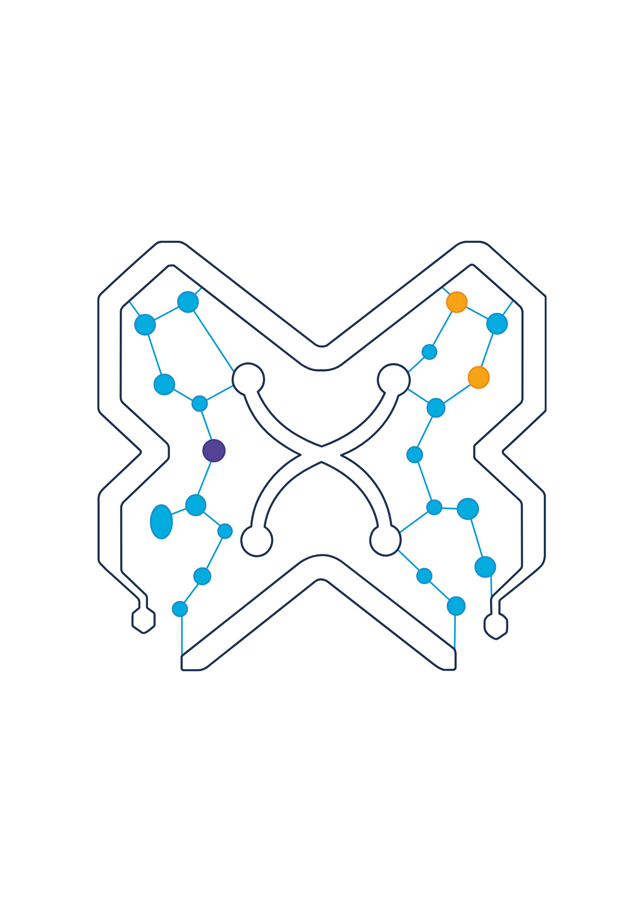

# GTU Blockchain – Resmi Web Sitesi

<p align="center">

</p>

[Gebze Teknik Üniversitesi](https://www.gtu.edu.tr/) blokzincir odaklı teknoloji ve inovasyon topluluğu **GTU Blockchain**'in resmi web sitesidir.

## Hakkımızda

GTU Blockchain, blokzincir teknolojileri, Web3 ve merkeziyetsiz uygulamalar alanında çalışan öğrencilerin bir araya geldiği bir topluluktur. Hackathon katılımları, projeler ve teknik etkinliklerle sektöre katkı sağlamayı hedefler.

## Özellikler

- 🌐 **Çoklu dil desteği** – Türkçe ve İngilizce
- 📍 **Dünya haritası** – Katıldığımız hackathon ve yarışmaların ülkelere göre görselleştirilmesi
- 🏆 **Hackathon zaferleri** – ETHRome, ETHIstanbul, ETHGlobal Prague vb. başarılarımız
- 👥 **Yönetim ve ekipler** – Topluluk yapımız ve komiteler
- 🔘 **CTA butonları** – Katıl ve Projelerimiz yönlendirmeleri
- 📝 **Üyelik formu** – Google Form bağlantısı
- 📋 **Komite başvuru formu** – Ekip seçimleri için
- 💬 **Instagram iletişim** – Hızlı iletişim linki

```

## İletişim

- 🐦 [Twitter / X](https://x.com/gtublockchain)
- 📸 [Instagram](https://www.instagram.com/gtublockchain/)
- 💼 [LinkedIn](https://www.linkedin.com/company/gtublockchain/)
- 📺 [TikTok](https://www.tiktok.com/@gtublockchain)
- 💻 [GitHub](https://github.com/GTU-Blockchain)

---

© 2025 GTU Blockchain Community. Tüm hakları saklıdır.
